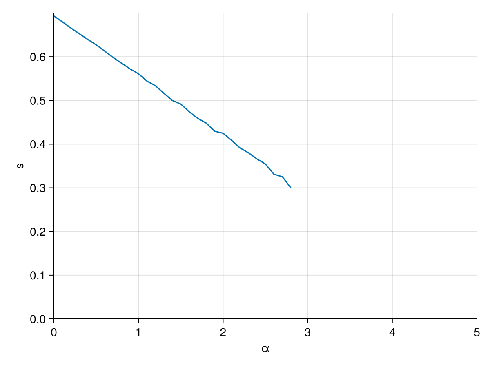
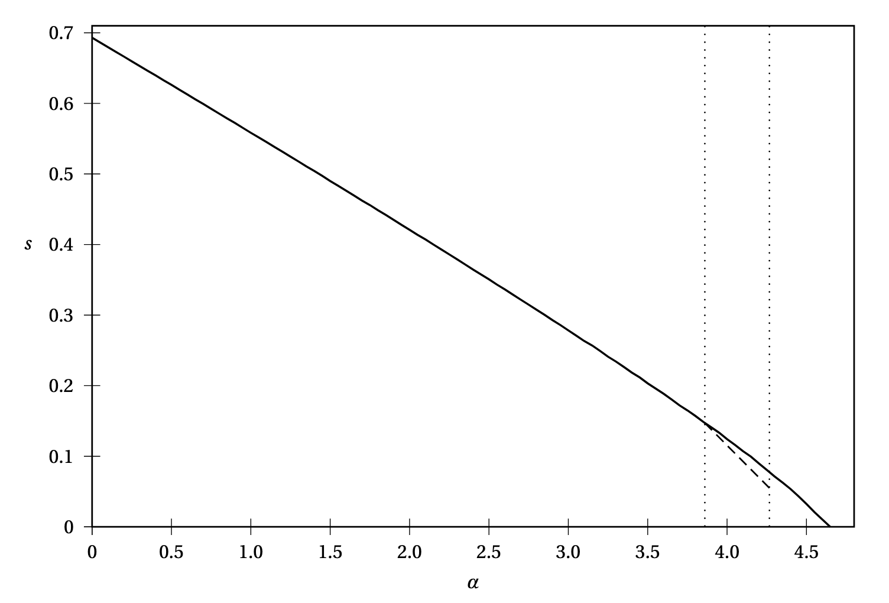

# BP for K-SAT

Backend: GenericMessagePassing.jl at https://github.com/ArrogantGao/GenericMessagePassing.jl, it implements the bp algorithm, random K-SAT instances, and its tensor network model.

In `entropy_density.jl`, we run BP on random K-SAT instances with (n = 100, k = 3) and plot the entropy density.

The one from the book:

